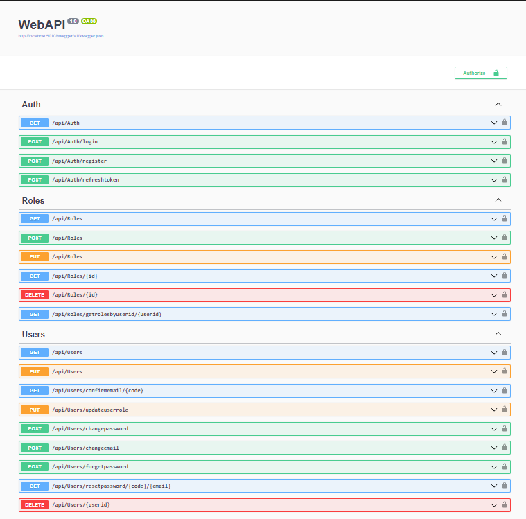

# NET6 Clean-Onion Architecture Project

 </img>

## Features
- .NET6
- Entity Framework Core – Code First
- Repository Pattern
- UnitOfWork Pattern
- CQRS Pattern
- Mediatr
- CQRS Pipeline Caching (Redis,InMemory configure from appsettings.json file)
- Response Wrappers
- Fluent Validation
- Validation Filter 
- Serilog Logging 
- Automapper
- Docker
- JWT Authentication,Refresh Token
- Complete User Management  (Register / Forgot Password / Confirmation Mail) Without Identity
- Role Based Authorization
- Database Seeding
- Custom Exception Handling Middleware


## How To Start .Net API

For api, you must edit the appsettings.json file email settings eg.

Docker support added you can start project with docker, first you must look docker compose yaml file rediscache settings eg. and write 

```sh
docker compose -f "docker-compose.yml" up -d --build
```
When the project is up, the migrations run automatically

After a database will be created. 

Default Admin Account : 

```sh
Username : admin
Password : 159357456qW
```


